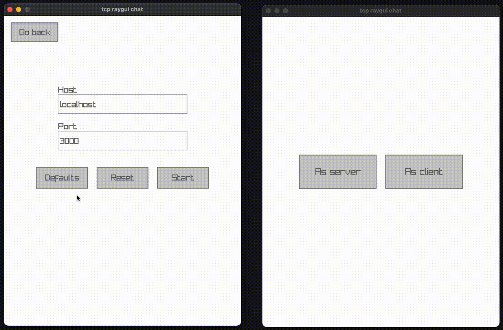

# tcp raygui chat

A simple tcp chat build with [raylib](https://www.raylib.com/) and [raygui](https://github.com/raysan5/raygui).

I've been learning go and really wanted to give raylib a try so I made this.

